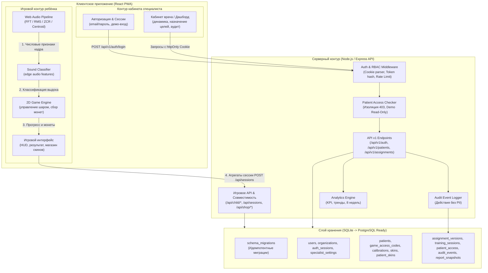

# Архитектура и потоки данных платформы «Лёгкие на подъём»

## Общая схема системы



---

## Компоненты системы

1. **React 19 PWA** — единая SPA-поставка:
   - Контур ребёнка: калибровка, 2D-игра, магазин скинов и автовыдача достижений;
   - Контур специалиста: авторизация, демо-режим, карточки пациентов, назначения, динамика.
2. **Web Audio Pipeline (Edge / Client-Side)**:
   - Обработка аудиопотока в реальном времени исключительно в памяти браузера (`Float32Array`);
   - Извлечение 5 числовых признаков: RMS, ZCR, спектральный центроид, спектральная плоскостность, crest factor;
   - **Сырое аудио не сохраняется и не передаётся на сервер.**
3. **Игровой движок**:
   - 2D-физика движения шара в процентах viewport, отрисовка через DOM/CSS;
   - Управление по целевому выдоху (`targetBreaths`), генерация волн облаков и сбор монет;
   - Защита от накрутки: демо-сессии не дают монет и не влияют на клинические KPI.
4. **Express API**:
   - **API v1**: безопасность, сессии на httpOnly cookie, изоляция пациентов (`patient_access`), RBAC (`admin`, `specialist`, `demo_specialist`), версионируемые назначения (`assignment_versions`), аудит-лог (`audit_events`);
   - **Игровой API**: обратная совместимость для входа ребёнка по коду, сохранения калибровок и сессий.
5. **Слой данных (SQLite с готовностью к PostgreSQL)**:
   - Идемпотентные миграции через `schema_migrations`;
   - Строгая изоляция персональных данных (псевдонимизация);
   - Реляционная схема из 14 нормализованных таблиц.

---

## Граница аудиоданных и приватность

```text
Микрофон ребёнка (MediaStream)
  │
  ▼
[AnalyserNode (FFT 2048)]
  │
  ▼
[Float32Array кадр (в RAM)] ──(вычисление признаков)──> AudioFeatures { rms, zcr, centroid, flatness }
  │                                                              │
  ▼ (уничтожается GC)                                            ▼
[Сырой звук стёрт]                                    [SoundClassification: kind, strength]
                                                                 │
                                                                 ▼
                                                      [2D Engine & Агрегаты занятия]
                                                                 │
                                                                 ▼ (только агрегаты сессии)
                                                      [POST /api/sessions: duration, avgStrength, stability]
```

---

## Архитектура изоляции и безопасности (RBAC)

| Роль | Права | Ограничения |
|---|---|---|
| `admin` | Управление организациями, создание специалистов, полный аудит | Не имеет прямого отношения к игровому контуру ребёнка |
| `specialist` | Просмотр только своих пациентов (`patient_access`), создание версий назначений (`assignment_versions`), смена своего пароля | Ответ `403 Forbidden` при попытке доступа к чужому пациенту |
| `demo_specialist` | Просмотр синтетических демо-профилей (5 сценариев) | **Строго Read-Only**: любые мутации (`POST`, `PUT`, `DELETE`, `PATCH`) блокируются с кодом `403` |

Все действия пользователей (вход, выход, просмотр карточки, создание назначения, неудачные попытки) фиксируются в `audit_events` без включения персональных данных (ПДн) в поле `details`.

---

## UI кабинета специалиста

Кабинет живёт в каталоге `src/specialist/` и полностью работает на `/api/v1/...`.
Интерфейса этапа 1 (`/api/clinician/*`, `/specialist-legacy`) больше нет.

```text
src/specialist/
├── routes.tsx              # Единое определение маршрутов: /login, /demo, /specialist/*
├── AuthContext.tsx         # Текущий пользователь, роль, canMutate, refresh, logout
├── SpecialistLayout.tsx    # Защита маршрутов + общий каркас
├── hooks.ts                # useViewport: laptop | tablet | phone
├── components/
│   ├── AppShell.tsx        # Боковая навигация, верхняя полоса, метка режима просмотра
│   ├── ui.tsx              # Panel, KpiCard, StatusPill, AttentionBadge, Pagination, ValidationNote
│   ├── charts.tsx          # Инлайновые SVG-графики без внешних библиотек
│   └── AddPatientDialog.tsx
├── lib/                    # format.ts (даты, проценты), csv.ts (выгрузка), pdf.ts (заготовка печати)
└── pages/
    ├── LoginPage.tsx       # Вход по email и паролю
    ├── DemoEntryPage.tsx   # Демонстрационный режим, только просмотр
    ├── DashboardPage.tsx   # KPI, динамика, «Требуют внимания», последние занятия
    ├── PatientsPage.tsx    # Таблица детей: фильтры, сортировки, поиск, пагинация
    ├── SessionsPage.tsx    # Глобальный журнал занятий и выгрузка CSV
    ├── SettingsPage.tsx    # Профиль, безопасность, уведомления, назначения, данные
    ├── PatientDetailPage.tsx  # Шапка карточки ребёнка и вкладки
    └── patient/            # OverviewTab, ChartsTab, SessionsTab, ReportsTab, AssignmentsTab
```

### Маршруты кабинета

| Путь | Экран |
|---|---|
| `/login` | Вход специалиста |
| `/demo` | Вход в режим просмотра |
| `/specialist` | Сводка |
| `/specialist/patients` | Список детей |
| `/specialist/patients/:id/:tab` | Карточка: `overview`, `charts`, `sessions`, `reports`, `assignments` |
| `/specialist/sessions` | Журнал занятий |
| `/specialist/settings` | Настройки |

### Поток данных экрана

```text
Страница  ──api.v1.*──▶  /api/v1/...  ──▶  requireAuth + hasPatientAccess + requireMutationAllowed
   ▲                                             │
   │                                             ▼
   └────── DTO из src/types.ts ◀──── server/insights/* (dashboard, patients, attention, patientAnalytics)
```

Расчёты KPI, регулярности и признаков «требует внимания» живут на сервере в `server/insights/`,
клиент только отображает готовые значения. Один и тот же модуль используют и дашборд, и карточка,
поэтому цифры на разных экранах не расходятся.

### Роли в интерфейсе

`AuthContext` отдаёт флаг `canMutate` (`false` для `demo_specialist`). При `canMutate === false`
скрываются формы создания ребёнка, редактирования назначения, формирования отчёта и сохранения
настроек, а в шапке появляется метка «Демонстрационный режим». Это только слой удобства:
решение принимает сервер — любая мутация от `demo_specialist` завершается `403`.

### Адаптивность

`useViewport` различает три ширины:

* **laptop** — полный интерфейс;
* **tablet** — боковая навигация сворачивается в кнопку меню;
* **phone** — только просмотр: редактирование назначений скрыто независимо от роли.

### Оформление

Стили кабинета вынесены в `src/styles/specialist.css` с префиксом `sp-` и не пересекаются со
стилями игры. Палитра: голубой как основной акцент, мягкий зелёный для положительных значений,
оранжевый для пропусков; тонкие линии, скруглённые панели, плавные переходы 0.18–0.25 с.
Иконки — единый набор `lucide-react`. Физиологические показатели сопровождаются сноской
о необходимости валидации специалистом.
